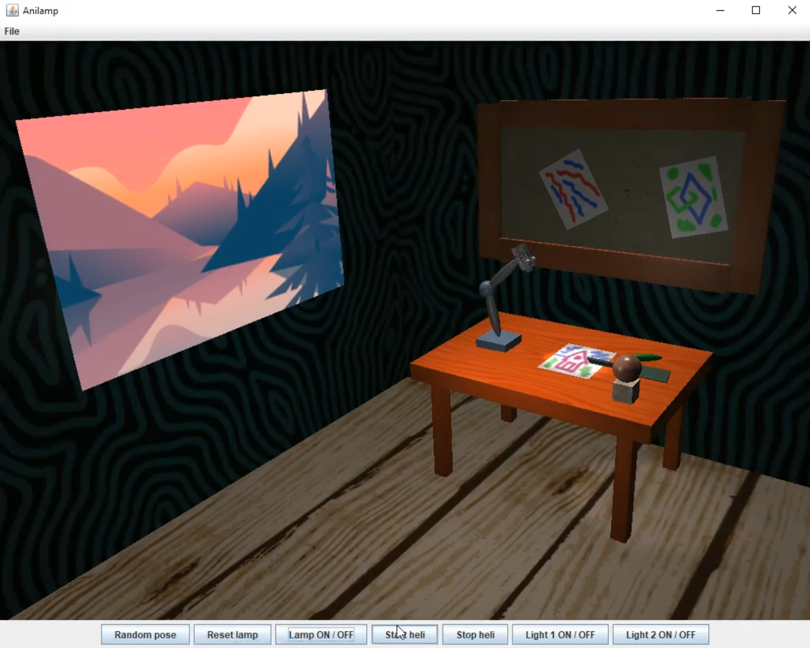

# Anilamp
Interactive animation created with Java and OpenGL (with JOGL wrapper)

# How to run
Requirements:
- Java (ideally Java 15)
- Jogl 2.3.2

Steps:
1. Open cmd and execute `setupjogl232.bat` (adds JOGL libraries to path)
2. Move to src folder and compile main class with `javac Anilamp.java`
3. Start program with `java Anilamp`
4. Interact with objects and lights using UI buttons
